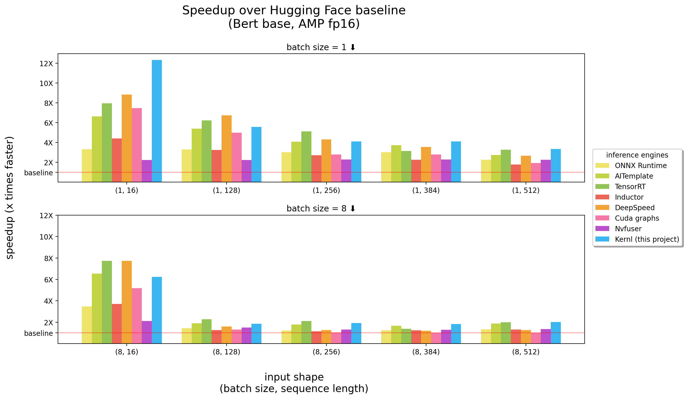

---
[](https://github.com/ELS-RD/kernl/actions/workflows/test.yaml)

**Kernl lets you run Pytorch transformer models several times faster on GPU with a single line of code,** 
**and is designed to be easily hackable.**

<p align="center">
  
</p>

*benchmarks ran on a 3090 RTX*

Kernl is the first OSS inference engine written in ~~CUDA C~~ [OpenAI Triton](https://openai.com/blog/triton/), 
a new language designed by OpenAI to make it easier to write GPU kernels.  
Each kernel is less than 200 lines of code, and is **easy to understand** and modify.

## Tutorials - End to End Use Cases

A list of Examples contains how to use kernl with Pytorch.

| Topic                                                                                                         | Notebook                                                                                   |
|---------------------------------------------------------------------------------------------------------------|--------------------------------------------------------------------------------------------|
| **Tiled matmul**: matrix multiplication implementation in `CUDA` style                                        | [link](https://github.com/ELS-RD/kernl/blob/main/tutorial/1%20-%20tiled%20matmul.ipynb)    |
| **Matmul offsets**: detailed explanations related to a performance trick used in Triton matmul implementation | [link](https://github.com/ELS-RD/kernl/blob/main/tutorial/2%20-%20matmul%20offsets.ipynb)  |
| **Online softmax**: parallelized softmax computation, a key ingredient of `Flash Attention`                   | [link](https://github.com/ELS-RD/kernl/blob/main/tutorial/3%20-%20online%20softmax.ipynb)  |
| **`Flash Attention`**: attention computation without saving attention matrix to global memory                 | [link](https://github.com/ELS-RD/kernl/blob/main/tutorial/4%20-%20flash%20attention.ipynb) |
| **XNLI classification**: classification with / without optimizations (`Roberta` + `XNLI` classification task) | [link](https://github.com/ELS-RD/kernl/blob/main/tutorial/bert%20e2e.ipynb)                |
| **Text generation**: with/without optimizations (`T5`)                                                        | [link](https://github.com/ELS-RD/kernl/blob/main/tutorial/t5%20e2e.ipynb)                  |
| **Transcription generation**: with/without optimizations (`Whisper`)                                          | [link](https://github.com/ELS-RD/kernl/blob/main/experimental/whisper/speedup.ipynb)       |
| **Llama version 2 optimization by kernel fusion                                                               | [link](https://github.com/ELS-RD/kernl/blob/main/experimental/llama-v2)                    |

## Installation

**IMPORTANT**: This package requires `pytorch` being installed.  
Please install it first.

```shell
pip install 'git+https://github.com/ELS-RD/kernl'
# or for local dev, after git clone ...
pip install -e .
```

This project requires `Python` >= 3.9.
Furthermore, the library requires an Ampere GPU and CUDA to be installed. 

If you prefer `Docker`:

```shell
# build
DOCKER_BUILDKIT=1 docker build -t kernl .
# run
docker run --rm -it --gpus all -v $(pwd):/kernl kernl
```

## Getting started

```python
import torch
from transformers import AutoModel
from kernl.model_optimization import optimize_model

model = AutoModel.from_pretrained("model_name").eval().cuda()
optimize_model(model)

inputs = ...

with torch.inference_mode(), torch.cuda.amp.autocast():
    outputs = model(**inputs)
```

For end-to-end use cases, you may want to check:

* [XNLI classication with Roberta](./tutorial/bert%20e2e.ipynb)
* [text generation with T5](./tutorial/t5%20e2e.ipynb)

## Test and Benchmark

### Conventions

- A test function using benchmark features must have a name that starts with `test_benchmark_`
- Benchmark function must have a param called `implementation` when benchmarking the same operation using different
  strategy

### Run tests and benchmarks

```shell
# tada!
pytest
```

There are over 2K benchmarks, and they take a while to run.

Some rules on how `PyTest` works, in particular for benchmarks:

- add `-k` to filter tests/benchmarks by their name like `pytest -k benchmark` to run only tests with `benchmark`
  in their name
- you can combine expressions in the filter: `pytest -k "benchmark and not bert"` if you want to run all benchmarks
  except those related to BERT
- to group and compare benchmark measures, use `pytest -k benchmark --benchmark-group-by ...`:
  - groupinng by names: `pytest -k benchmark --benchmark-group-by fullfunc`
  - grouping by names of parameters: `pytest -k benchmark --benchmark-group-by param:implementation,param:shape`
    - `param:x`, `x` is the parameter name in `@pytest.mark.parametrize`
  - combining both: `pytest -k benchmark --benchmark-group-by fullfunc,param:implementation`
- add `-s` to see the output of the tests (print, etc.)
- add `-v` to see the verbose output of the tests

*WARNING*: `param:X` will make PyTest crash if `X` is not a parameter of at least one of the function ran.

Some useful commands:

```shell
# only benchmarks
pytest -k benchmark
# no benchmarks
pytest -k "not benchmark"
# only linear layers benchmark, group by shape and if the input is contiguous or not 
pytest test/test_linear_layer.py --benchmark-group-by fullfunc,param:shape,param:contiguous
```

## Create new patterns to replace fx graph nodes

The first step to replace function/module calls in the graph is to create the pattern that will be replaced.
The easiest way to do this is to [convert the model to a fx graph](https://pytorch.org/docs/stable/fx.html), and then
print it with `utils.graph_report` or by printing the code `print(you_graph_module.code)`

Then you can use [replace_pattern](https://pytorch.org/docs/stable/fx.html#torch.fx.replace_pattern) to replace the
pattern in the graph. We have our own version of `replace_pattern` with some enhancements to work with modules, for
example. You can find examples of that in `optimizer` folder.

## Code Formatting

We use `black` / `isort` / `flake8` to format the code. You can run them with:

```shell
make source_code_format
make source_code_check_format
```

## Why?

At Lefebvre Sarrut, we run several transformers in production, some of them being latency sensitive (search and recsys mostly).

We are using OnnxRuntime and TensorRT and even created 
[transformer-deploy](https://github.com/ELS-RD/transformer-deploy) an OSS library to share our knowledge with the community.  
Recently, we were testing generative languages, and we tried to accelerate them. It proves very difficult with traditional tools.

Basically, and to make it short, it seems to us that Onnx (the main format to feed those tools) is an interesting 
format with a wide range support of hardware. 

However, its ecosystem (and mostly inference engines) has several limitations when we deal with new LLM architectures :

* Export to Onnx is simple for models without control flow because we can rely on tracing, 
  but dynamic behaviors are harder to obtain (see https://ppwwyyxx.com/blog/2022/TorchScript-Tracing-vs-Scripting/ for 
  more info, it’s about torchscript but is exactly the same for onnx).
* Unlike Pytorch, both ONNX Runtime/TensorRT have not yet native support for multi GPUs tasks enabling tensor parallelism
* TensorRT is not able to manage 2 dynamic axis for transformer models with the same profile. 
  Because usually we want to be able to provide inputs of different lengths, we need to build 1 model per batch size.
* Very large models are common and Onnx (as a protobuff file) has some limitations regarding its file size, 
  requiring to store weights outsides of the model to workaround.

One thing very annoying is the fact that new models are never accelerated, you need to wait for someone to write custom CUDA kernels for that.

It’s not to say the solutions are bad, one big thing with OnnxRuntime is its multi hardware support.  
Regarding TensorRT, it’s really fast.

So we wanted something as fast as TensorRT and on Python / PyTorch, that’s why we built Kernl.

## How?

The simple rule is memory bandwidth is often the bottleneck in deep learning, to accelerate inference, memory access 
reduction is usually a good strategy. 
On short input sequence, the bottleneck is often related to the CPU overhead, it has to be removed too. 
Counterintuitively, to make things faster, you don’t need to be faster in computation.

We leverage mostly 3 technologies:

* [OpenAI Triton](https://triton-lang.org/): it’s a language to write GPU kernels like CUDA (not to be confused with 
  Nvidia Triton inference server), but much more productive (at least for us). 
  Improvement is due to the fusion of several ops, making us able to chain computations without
  saving intermediate results in GPU memory. We are using it to rewrite:

  * Attention (replaced by Flash Attention),
  * Linear layer and their activation,
  * and finally Layernorm/Rmsnorm.

* [CUDA graphs](https://pytorch.org/blog/accelerating-pytorch-with-cuda-graphs/) : you may have heard that Python is slow,
  blablabla and to limit overhead C++/Rust should be the solution.
  It is true but better than low overhead is no overhead at all. That’s CUDA graphs!
  During a warmup step, it will save every kernel launched and their parameters, and then, with a single GPU instruction,
  we can replay the whole inference.

* [TorchDynamo](https://github.com/pytorch/torchdynamo/): this prototype from Meta helps us to cope with dynamic
  behavior. It’s described [here](https://dev-discuss.pytorch.org/t/torchinductor-a-pytorch-native-compiler-with-define-by-run-ir-and-symbolic-shapes/747),
  and in a few words during a warmup step it traces the model and provides a Fx graph (a static computation graph).
  We replace some operations of this graph with our kernels and recompile it in Python.
  We do that for any possible dynamic behavior we expect to have. During inference, inputs are analyzed, and the correct
  static graph is used. It’s really an awesome project, check their repo to know more.

## Acknowledgments

Code of OpenAI Triton kernels takes inspiration from examples from OpenAI Triton tutorials or xformers library.  

## Contributing

If you would like to contribute, for example to code or documentation, please see our [contribution guide](https://www.kernl.ai/contribution-guide/contributing/).

## Code of Conduct

Please see our [Code of Conduct](https://www.kernl.ai/contribution-guide/code-of-conduct/) for any questions about the community we are trying to build and what to do if you need help with someone who is acting unprofessionally.
