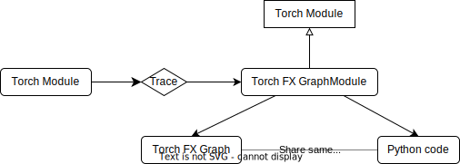
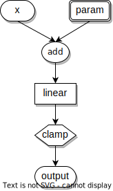
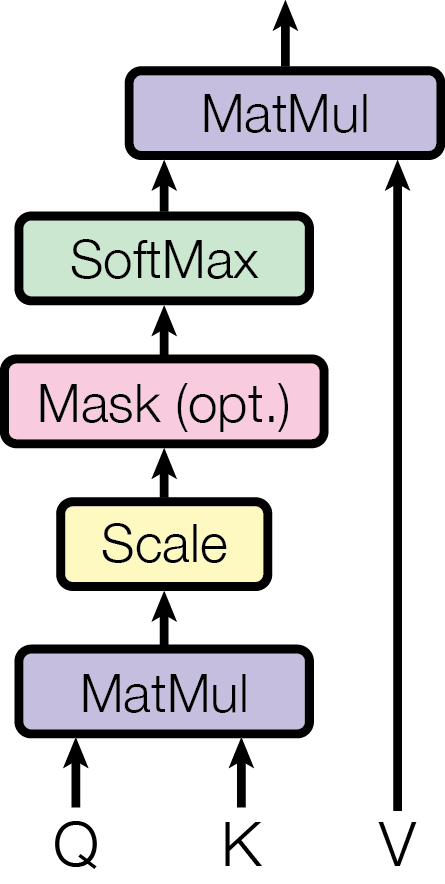

# How to support a new model

## How does Kernl optimize a model

### Overview

To optimize a model, Kernl uses [TorchDynamo](https://github.com/pytorch/torchdynamo) JIT compiler and provides a custom backend where we replace part of the [Torch FX](https://pytorch.org/docs/1.13/fx.html) graph with optimized kernels.

The custom backend is defined in [src/kernl/model_optimization.py](https://github.com/ELS-RD/kernl/blob/v0.1.0/src/kernl/model_optimization.py#L44)

``` { .py }
def compiler(gm: torch.fx.GraphModule, example_inputs: List[torch.Tensor]):
    dynamo_backend_ofi(gm)
    return cuda_graphs_wrapper(gm, example_inputs, pool=pool)
```
This backend combines two steps:

- First one is to apply the graph replacements
- Second one is to use [CUDA graphs](https://pytorch.org/blog/accelerating-pytorch-with-cuda-graphs/)

The second step eliminates most of the CPU overhead but we won't elaborate on this and focus on the first one that does the graph replacements.


### Inspecting the FX Graph

First, a few words about [Torch FX](https://pytorch.org/docs/1.13/fx.html).
Torch FX is a torch module to module transformation toolkit. It can trace a torch module (or a function) execution. All the operations are then recorded into a graph of nodes. From this graph, Torch FX generates python code matching the graph's semantics. Both graph and python code are accessible from the Torch FX GraphModule, which is also a torch module instance. Torch FX allows us to play with FX graphs but stay at the torch module level.

<figure markdown>
  { lazyload=true }
  <figcaption>Torch FX</figcaption>
</figure>

With a FX GraphModule, we can inspect both the FX Graph and the generated code, with `.graph` and `.code` respectively. For better readability, one may want to use `#!python graph_report(gm)` that print the FX Graph in a tabular way (similarly to [Torch FX `print_tabular` method](https://pytorch.org/docs/1.13/fx.html#torch.fx.Graph.print_tabular))[^1].

[^1]: Aditionnaly, we can enable [TorchDynamo](https://github.com/pytorch/torchdynamo)'s tracing with `#!python torch._dynamo.config.log_level = logging.DEBUG` to display the compiled graph. Enabling `#!python torch._dynamo.config.output_graph_code` displays the graph's code instead. See [TorchDynamo's configuration](https://github.com/pytorch/pytorch/blob/ebeecbf833dfbeba07bd5d88e2bb24f63240bfa4/torch/_dynamo/config.py) for details.

`#!python graph_report(gm)` lists all the operations during the execution. Each line corresponds to a node from the FX Graph with the given information:

- `opcode` is the kind of operation
- `name` is the node name, usually the operation name
- `target` is the operation applied in this node
- `args` and `kwargs` are the arguments given to the operation

For more precise information on the kind of nodes and their semantics [see the Torch FX Node documentation](https://pytorch.org/docs/1.13/fx.html#torch.fx.Node).

For example, if we trace this following torch module into a FX GraphModule:

``` { .py }
class MyModule(torch.nn.Module):
    def __init__(self):
        super().__init__()
        self.param = torch.nn.Parameter(torch.rand(3, 4))
        self.linear = torch.nn.Linear(4, 5)

    def forward(self, x):
        return self.linear(x + self.param).clamp(min=0.0, max=1.0)


m = MyModule()
gm = torch.fx.symbolic_trace(m)
```

We can print the graph with the `graph_report(gm)` function:

```
opcode         name    target                   args        kwargs
-------------  ------  -----------------------  ----------  ------------------------
placeholder    x       x                        ()          {}
get_attr       param   param                    ()          {}
call_function  add     <built-in function add>  (x, param)  {}
call_module    linear  linear                   (add,)      {}
call_method    clamp   clamp                    (linear,)   {'min': 0.0, 'max': 1.0}
output         output  output                   (clamp,)    {}
----------
Used modules
----------
name    target_type
------  ------------------------------------------------
linear  Linear(in_features=4, out_features=5, bias=True)
```

We can see here every operation listed in computation order, from getting the forward function parameter to returning the output. One more useful thing that `graph_report(gm)` does is to print the list of torch modules used in the graph, as in the node list we only have the torch module names and not the actual torch module types.

The generated code from this FX Graph is the following:

``` { .py }
def forward(self, x):
    param = self.param
    add = x + param;  x = param = None
    linear = self.linear(add);  add = None
    clamp = linear.clamp(min = 0.0, max = 1.0);  linear = None
    return clamp
```

More visually, we can draw the FX Graph to better see the computation. In this representation, edges represent the link between a node and the nodes in its arguments (we're discarding `args` and `kwargs` that are note previously defined nodes):

<figure markdown>
  { lazyload=true }
  <figcaption>FX Graph</figcaption>
</figure>

### Replace part of the FX Graph

An FX Graph [can be modified directly](https://pytorch.org/docs/1.13/fx.html#direct-graph-manipulation) but we'll rather use subgraph rewriting.

To rewrite the Torch FX Graph, Kernl uses the `#!python repace_pattern()` function defined in [src/kernl/utils/extended_matcher.py](https://github.com/ELS-RD/kernl/blob/v0.1.0/src/kernl/utils/extended_matcher.py#L337). It's the same function `#!python repace_pattern()` of [Torch FX](https://pytorch.org/docs/1.13/fx.html#subgraph-rewriting-with-replace-pattern) but with some bugfixes (that should be integrated in PyTorch in the future).

``` { .py }
def replace_pattern(gm: GraphModule, pattern: Callable, replacement: Callable) -> List[Match]:
```

The function takes a graph `gm` and two callables `pattern` and `replacement` that can be either a torch module or a function. It'll convert `pattern` and `replacement` to an FX Graph and try to replace subgraphs from `gm` matching `pattern` with `replacement`.

For example, given this 2-layers perceptron model, we'd like to replace the first layer activation from `tanh` to `reLU`.

``` { .py }
class FeedForward(torch.nn.Module):

    def __init__(self, input_size, hidden_size):
        super(FeedForward, self).__init__()
        self.fc1 = torch.nn.Linear(input_size, hidden_size)
        self.tanh = torch.nn.Tanh()
        self.fc2 = torch.nn.Linear(hidden_size, 1)
        self.sigmoid = torch.nn.Sigmoid()

    def forward(self, x):
        hidden = self.fc1(x)
        tanh = self.tanh(hidden)
        output = self.fc2(tanh)
        output = self.sigmoid(output)
        return output

m = Feedforward(5, 10)
```

By tracing this module, we can print the FX Graph:

``` { hl_lines="4 5" }
opcode       name     target    args        kwargs
-----------  -------  --------  ----------  --------
placeholder  x        x         ()          {}
call_module  fc1      fc1       (x,)        {}
call_module  tanh     tanh      (fc1,)      {}
call_module  fc2      fc2       (tanh,)     {}
call_module  sigmoid  sigmoid   (fc2,)      {}
output       output   output    (sigmoid,)  {}
----------
Used modules
----------
name     target_type
-------  -------------------------------------------------
fc1      Linear(in_features=5, out_features=10, bias=True)
tanh     Tanh()
fc2      Linear(in_features=10, out_features=1, bias=True)
sigmoid  Sigmoid()
```
We see that the graph is a straightforward sequence of operations. To replace the first layer and its activation function, we just need to match the highlighted subgraph. To achieve that we create a simple torch module with a linear module and the tanh activation function.

``` { .py }
class Pattern(torch.nn.Module):
    def __init__(self):
        super().__init__()
        self.linear = torch.nn.Linear(1, 1)
        self.activation = torch.nn.Tanh()

    def forward(self, v):
        return self.activation(self.linear(v))
```

The corresponding FX Graph is the following:

```
opcode       name        target      args           kwargs
-----------  ----------  ----------  -------------  --------
placeholder  v           v           ()             {}
call_module  linear      linear      (v,)           {}
call_module  activation  activation  (linear,)      {}
output       output      output      (activation,)  {}
----------
Used modules
----------
name        target_type
----------  ------------------------------------------------
linear      Linear(in_features=1, out_features=1, bias=True)
activation  Tanh()
```

We don't need the node names to be the same as the ones in the graph we want to match, what is important is that we match the same node pattern. In our example, the node names differ (`fc1` and `tanh` in the graph, `linear` and `activation` in the pattern subgraph), but the modules called are identical (`Linear` and `Tanh`).

We have our pattern subgraph, we may now write our replacement subgraph with the ReLU activation function and display its FX Graph.

``` { .py }
class Replacement(torch.nn.Module):
    def __init__(self):
        super().__init__()
        self.linear = torch.nn.Linear(1, 1)
        self.relu = torch.nn.ReLU()

    def forward(self, v):
        return self.relu(self.linear(v))
```

```
opcode       name    target    args       kwargs
-----------  ------  --------  ---------  --------
placeholder  v       v         ()         {}
call_module  linear  linear    (v,)       {}
call_module  relu    relu      (linear,)  {}
output       output  output    (relu,)    {}
----------
Used modules
----------
name    target_type
------  ------------------------------------------------
linear  Linear(in_features=1, out_features=1, bias=True)
relu    ReLU()
```

Unlike the matching pattern, we must be a bit cautious of the node names in the replacement pattern. If we want to reuse the nodes matched in the graph, we must use the same node names as in the pattern. Otherwise, it'll create a new node in the graph. In our example, the `linear` and the `v` node are kept from the node matched in the original graph but the `relu` node is added to the graph.

Finally, we can apply the replacement and look at the resulting FX Graph:

``` { .py }
replace_pattern(gm, Pattern(), Replacement())
```

```
opcode       name     target    args        kwargs
-----------  -------  --------  ----------  --------
placeholder  x        x         ()          {}
call_module  linear   fc1       (x,)        {}
call_module  relu     relu      (linear,)   {}
call_module  fc2      fc2       (relu,)     {}
call_module  sigmoid  sigmoid   (fc2,)      {}
output       output   output    (sigmoid,)  {}
----------
Used modules
----------
name     target_type
-------  -------------------------------------------------
fc1      Linear(in_features=5, out_features=10, bias=True)
relu     ReLU()
fc2      Linear(in_features=10, out_features=1, bias=True)
sigmoid  Sigmoid()
```

The resulting graph has switched from `tanh` activation to `reLU`, the `fc1` node has been kept untouched.

When we don't need to match a call to a torch submodule, it's easier to write pattern and a replacement as functions, as we'll see in [our example with BERT attention].

  [our example with BERT attention]: #example-replacing-bert-attention

There are some limitations with subgraph rewriting. When we use a function not covered by Torch FX, we'll have to use [Torch wrap function](https://pytorch.org/docs/1.13/fx.html#non-torch-functions) in order to appear in the FX Graph but not to be traced.

``` { .py }
torch.fx.wrap(fn)
```

## Example: replacing BERT Attention

In this example, we'll see how to replace the attention part of a BERT model with Kernl's optimized attention kernel.

### Understanding Attention

First, we need to look how attention works, the [original paper](https://arxiv.org/abs/1706.03762) "Attention Is All You Need" is a good starting point. More specifically, we'll focus on the Attention part where the attention function is defined:

!!! quote "Attention Is All You Need"
    An attention function can be described as mapping a query and a set of key-value pairs to an output,
    where the query, keys, values, and output are all vectors. The output is computed as a weighted sum
    of the values, where the weight assigned to each value is computed by a compatibility function of the
    query with the corresponding key.

    (...)

	We call our particular attention "Scaled Dot-Product Attention". The input consists of
	queries and keys of dimension $d_k$, and values of dimension $d_v$. We compute the dot products of the
    query with all keys, divide each by $\sqrt{d_k}$, and apply a softmax function to obtain the weights on the
    values.
    In practice, we compute the attention function on a set of queries simultaneously, packed together
    into a matrix $Q$. The keys and values are also packed together into matrices $K$ and $V$. We compute
    the matrix of outputs as:

    $$
    \operatorname{Attention}(Q,K,V)=\operatorname{softmax}(\frac{QK^T}{\sqrt{d_k}})V
    $$

This function can be represented as a computation graph where the attention mask is added in the process:

<figure markdown>
  { width="150"; lazyload=true }
  <figcaption>Scaled Dot-Product Attention</figcaption>
</figure>

This graph representation will be useful as it is this graph we'll try to replace to optimize a BERT model.

### Find the Attention graph pattern

For our example, we'll replace the attention part from the "bert-base-uncased" pre-trained model from [Hugging Face Transformers](https://huggingface.co/transformers). If we look at the [BERT implementation](https://github.com/huggingface/transformers/blob/v4.24.0/src/transformers/models/bert/modeling_bert.py#L243), we find the attention function as a torch module:

=== "Code Excerpt"

    ```{ .py .annotate }
    class BertSelfAttention(nn.Module):
        def forward(
            self,
            hidden_states: torch.Tensor,
            attention_mask: Optional[torch.FloatTensor] = None,
            head_mask: Optional[torch.FloatTensor] = None,
            encoder_hidden_states: Optional[torch.FloatTensor] = None,
            encoder_attention_mask: Optional[torch.FloatTensor] = None,
            past_key_value: Optional[Tuple[Tuple[torch.FloatTensor]]] = None,
            output_attentions: Optional[bool] = False,
        ) -> Tuple[torch.Tensor]:
            ...
            # Take the dot product between "query" and "key" to get the raw attention scores. # (1)
            attention_scores = torch.matmul(query_layer, key_layer.transpose(-1, -2))
            ...
            attention_scores = attention_scores / math.sqrt(self.attention_head_size) # (2)
            if attention_mask is not None:
                # Apply the attention mask is (precomputed for all layers in BertModel forward() function)
                attention_scores = attention_scores + attention_mask

            # Normalize the attention scores to probabilities. # (3)
            attention_probs = nn.functional.softmax(attention_scores, dim=-1)
            ...
            context_layer = torch.matmul(attention_probs, value_layer) # (4)
            ...
    ```

    1.  $QK^T$
    2.  $\frac{QK^T}{\sqrt{d_k}}$
    3.  $\operatorname{softmax}(\frac{QK^T}{\sqrt{d_k}})$
    4.  $\operatorname{softmax}(\frac{QK^T}{\sqrt{d_k}})V$

=== "Full Code"

    ```{ .py .annotate hl_lines="49 50 68 69 70 71 72 73 74 84" }
    class BertSelfAttention(nn.Module):
        def forward(
            self,
            hidden_states: torch.Tensor,
            attention_mask: Optional[torch.FloatTensor] = None,
            head_mask: Optional[torch.FloatTensor] = None,
            encoder_hidden_states: Optional[torch.FloatTensor] = None,
            encoder_attention_mask: Optional[torch.FloatTensor] = None,
            past_key_value: Optional[Tuple[Tuple[torch.FloatTensor]]] = None,
            output_attentions: Optional[bool] = False,
        ) -> Tuple[torch.Tensor]:
            mixed_query_layer = self.query(hidden_states)

            # If this is instantiated as a cross-attention module, the keys
            # and values come from an encoder; the attention mask needs to be
            # such that the encoder's padding tokens are not attended to.
            is_cross_attention = encoder_hidden_states is not None

            if is_cross_attention and past_key_value is not None:
                # reuse k,v, cross_attentions
                key_layer = past_key_value[0]
                value_layer = past_key_value[1]
                attention_mask = encoder_attention_mask
            elif is_cross_attention:
                key_layer = self.transpose_for_scores(self.key(encoder_hidden_states))
                value_layer = self.transpose_for_scores(self.value(encoder_hidden_states))
                attention_mask = encoder_attention_mask
            elif past_key_value is not None:
                key_layer = self.transpose_for_scores(self.key(hidden_states))
                value_layer = self.transpose_for_scores(self.value(hidden_states))
                key_layer = torch.cat([past_key_value[0], key_layer], dim=2)
                value_layer = torch.cat([past_key_value[1], value_layer], dim=2)
            else:
                key_layer = self.transpose_for_scores(self.key(hidden_states))
                value_layer = self.transpose_for_scores(self.value(hidden_states))

            query_layer = self.transpose_for_scores(mixed_query_layer)

            if self.is_decoder:
                # if cross_attention save Tuple(torch.Tensor, torch.Tensor) of all cross attention key/value_states.
                # Further calls to cross_attention layer can then reuse all cross-attention
                # key/value_states (first "if" case)
                # if uni-directional self-attention (decoder) save Tuple(torch.Tensor, torch.Tensor) of
                # all previous decoder key/value_states. Further calls to uni-directional self-attention
                # can concat previous decoder key/value_states to current projected key/value_states (third "elif" case)
                # if encoder bi-directional self-attention `past_key_value` is always `None`
                past_key_value = (key_layer, value_layer)

            # Take the dot product between "query" and "key" to get the raw attention scores. # (1)
            attention_scores = torch.matmul(query_layer, key_layer.transpose(-1, -2))

            if self.position_embedding_type == "relative_key" or self.position_embedding_type == "relative_key_query":
                seq_length = hidden_states.size()[1]
                position_ids_l = torch.arange(seq_length, dtype=torch.long, device=hidden_states.device).view(-1, 1)
                position_ids_r = torch.arange(seq_length, dtype=torch.long, device=hidden_states.device).view(1, -1)
                distance = position_ids_l - position_ids_r
                positional_embedding = self.distance_embedding(distance + self.max_position_embeddings - 1)
                positional_embedding = positional_embedding.to(dtype=query_layer.dtype)  # fp16 compatibility

                if self.position_embedding_type == "relative_key":
                    relative_position_scores = torch.einsum("bhld,lrd->bhlr", query_layer, positional_embedding)
                    attention_scores = attention_scores + relative_position_scores
                elif self.position_embedding_type == "relative_key_query":
                    relative_position_scores_query = torch.einsum("bhld,lrd->bhlr", query_layer, positional_embedding)
                    relative_position_scores_key = torch.einsum("bhrd,lrd->bhlr", key_layer, positional_embedding)
                    attention_scores = attention_scores + relative_position_scores_query + relative_position_scores_key

            attention_scores = attention_scores / math.sqrt(self.attention_head_size) # (2)
            if attention_mask is not None:
                # Apply the attention mask is (precomputed for all layers in BertModel forward() function)
                attention_scores = attention_scores + attention_mask

            # Normalize the attention scores to probabilities. # (3)
            attention_probs = nn.functional.softmax(attention_scores, dim=-1)

            # This is actually dropping out entire tokens to attend to, which might
            # seem a bit unusual, but is taken from the original Transformer paper.
            attention_probs = self.dropout(attention_probs)

            # Mask heads if we want to
            if head_mask is not None:
                attention_probs = attention_probs * head_mask

            context_layer = torch.matmul(attention_probs, value_layer) # (4)

            context_layer = context_layer.permute(0, 2, 1, 3).contiguous()
            new_context_layer_shape = context_layer.size()[:-2] + (self.all_head_size,)
            context_layer = context_layer.view(new_context_layer_shape)

            outputs = (context_layer, attention_probs) if output_attentions else (context_layer,)

            if self.is_decoder:
                outputs = outputs + (past_key_value,)
            return outputs
    ```

    1.  $QK^T$
    2.  $\frac{QK^T}{\sqrt{d_k}}$
    3.  $\operatorname{softmax}(\frac{QK^T}{\sqrt{d_k}})$
    4.  $\operatorname{softmax}(\frac{QK^T}{\sqrt{d_k}})V$

We see that the Hugging Face implementation is close to the definition from the paper, we want to find the attention pattern in this model.

To begin, we'll write a short script running the model with a dummy input:

``` { .py }
import torch
from transformers import AutoModel

from kernl.model_optimization import optimize_model


model = AutoModel.from_pretrained(pretrained_model_name_or_path="bert-base-uncased").eval().cuda()

optimize_model(model)
shape = (1, 128)

with torch.inference_mode(), torch.cuda.amp.autocast(enabled=True, dtype=torch.float16, cache_enabled=True):
    inputs = {
        "input_ids": torch.randint(2, 10000, shape, device="cuda", dtype=torch.long),
        "attention_mask": torch.ones(shape, device="cuda", dtype=torch.long),
    }
    output = model(**inputs)
```

If we run `#!python graph_report(gm)` and `#!python gm.code` in the `#!python dynamo_backend_ofi(gm)` function in the Kernl library, we can print the FX Graph and the python code from the model computation. For our example, we'll keep the `normalize_operators` and the `remove_dropout` functions as it simplifies the model's graph a bit.

``` { .py }
def dynamo_backend_ofi(gm: torch.fx.GraphModule, assume_causal=False):
    normalize_operators(gm)
    remove_dropout(gm)
    print(graph_report(gm))
    print(gm.code)
    return gm
```

Below is the resulting output, we only show the beginning of the graph until the first attention layer.

???+ example "Part of the FX Graph of BERT model"

    === "`#!python graph_report(gm)`"

        ```
           opcode         name                                               target                                                     args                                                                                     kwargs
        -------------  -------------------------------------------------  ---------------------------------------------------------  ---------------------------------------------------------------------------------------  ------------------------
        placeholder    input_ids                                          input_ids                                                  ()                                                                                       {}
        placeholder    attention_mask                                     attention_mask                                             ()                                                                                       {}
        get_attr       self_embeddings_token_type_ids                     self_embeddings_token_type_ids                             ()                                                                                       {}
        call_function  getitem                                            <built-in function getitem>                                (self_embeddings_token_type_ids, (slice(None, None, None), slice(None, 128, None)))      {}
        call_method    expand                                             expand                                                     (getitem, 1, 128)                                                                        {}
        call_function  getitem_1                                          <built-in function getitem>                                (attention_mask, (slice(None, None, None), None, None, slice(None, None, None)))         {}
        call_method    to                                                 to                                                         (getitem_1,)                                                                             {'dtype': torch.float32}
        call_function  sub                                                <built-in function sub>                                    (1.0, to)                                                                                {}
        call_function  mul                                                <built-in function mul>                                    (sub, -3.4028234663852886e+38)                                                           {}
        get_attr       self_embeddings_position_ids                       self_embeddings_position_ids                               ()                                                                                       {}
        call_function  getitem_2                                          <built-in function getitem>                                (self_embeddings_position_ids, (slice(None, None, None), slice(0, 128, None)))           {}
        call_module    self_embeddings_word_embeddings                    self_embeddings_word_embeddings                            (input_ids,)                                                                             {}
        call_module    self_embeddings_token_type_embeddings              self_embeddings_token_type_embeddings                      (expand,)                                                                                {}
        call_function  add                                                <built-in function add>                                    (self_embeddings_word_embeddings, self_embeddings_token_type_embeddings)                 {}
        call_module    self_embeddings_position_embeddings                self_embeddings_position_embeddings                        (getitem_2,)                                                                             {}
        call_function  add_37                                             <built-in method add of type object at 0x7f065046e4e0>     (add, self_embeddings_position_embeddings)                                               {}
        call_module    self_embeddings_layer_norm                         self_embeddings_LayerNorm                                  (add_37,)                                                                                {}
        call_module    self_encoder_layer_0_attention_self_query          self_encoder_layer_0_attention_self_query                  (self_embeddings_layer_norm,)                                                            {}
        call_module    self_encoder_layer_0_attention_self_key            self_encoder_layer_0_attention_self_key                    (self_embeddings_layer_norm,)                                                            {}
        call_method    view                                               view                                                       (self_encoder_layer_0_attention_self_key, (1, 128, 12, 64))                              {}
        call_method    permute                                            permute                                                    (view, 0, 2, 1, 3)                                                                       {}
        call_module    self_encoder_layer_0_attention_self_value          self_encoder_layer_0_attention_self_value                  (self_embeddings_layer_norm,)                                                            {}
        call_method    view_1                                             view                                                       (self_encoder_layer_0_attention_self_value, (1, 128, 12, 64))                            {}
        call_method    permute_1                                          permute                                                    (view_1, 0, 2, 1, 3)                                                                     {}
        call_method    view_2                                             view                                                       (self_encoder_layer_0_attention_self_query, (1, 128, 12, 64))                            {}
        call_method    permute_2                                          permute                                                    (view_2, 0, 2, 1, 3)                                                                     {}
        call_method    transpose                                          transpose                                                  (permute, -1, -2)                                                                        {}
        call_function  matmul                                             <built-in method matmul of type object at 0x7f065046e4e0>  (permute_2, transpose)                                                                   {}
        call_function  truediv                                            <built-in function truediv>                                (matmul, 8.0)                                                                            {}
        call_function  add_1                                              <built-in function add>                                    (truediv, mul)                                                                           {}
        call_function  softmax                                            <function softmax at 0x7f05eca5f790>                       (add_1,)                                                                                 {'dim': -1}
        call_function  matmul_1                                           <built-in method matmul of type object at 0x7f065046e4e0>  (softmax, permute_1)                                                                     {}
        call_method    permute_3                                          permute                                                    (matmul_1, 0, 2, 1, 3)                                                                   {}
        call_method    contiguous                                         contiguous                                                 (permute_3,)                                                                             {}
        call_method    view_3                                             view                                                       (contiguous, (1, 128, 768))                                                              {}
        call_module    self_encoder_layer_0_attention_output_dense        self_encoder_layer_0_attention_output_dense                (view_3,)                                                                                {}
        ```

    === "`#!python gm.code`"

        ```{ .py }
        def forward(self, input_ids : torch.Tensor, attention_mask : torch.Tensor):
            self_embeddings_token_type_ids = self.self_embeddings_token_type_ids
            getitem = self_embeddings_token_type_ids[(slice(None, None, None), slice(None, 128, None))];  self_embeddings_token_type_ids = None
            expand = getitem.expand(1, 128);  getitem = None
            getitem_1 = attention_mask[(slice(None, None, None), None, None, slice(None, None, None))];  attention_mask = None
            to = getitem_1.to(dtype = torch.float32);  getitem_1 = None
            sub = 1.0 - to;  to = None
            mul = sub * -3.4028234663852886e+38;  sub = None
            self_embeddings_position_ids = self.self_embeddings_position_ids
            getitem_2 = self_embeddings_position_ids[(slice(None, None, None), slice(0, 128, None))];  self_embeddings_position_ids = None
            self_embeddings_word_embeddings = self.self_embeddings_word_embeddings(input_ids);  input_ids = None
            self_embeddings_token_type_embeddings = self.self_embeddings_token_type_embeddings(expand);  expand = None
            add = self_embeddings_word_embeddings + self_embeddings_token_type_embeddings;  self_embeddings_word_embeddings = self_embeddings_token_type_embeddings = None
            self_embeddings_position_embeddings = self.self_embeddings_position_embeddings(getitem_2);  getitem_2 = None
            add_37 = torch.add(add, self_embeddings_position_embeddings);  add = self_embeddings_position_embeddings = None
            self_embeddings_layer_norm = self.self_embeddings_LayerNorm(add_37);  add_37 = None
            self_encoder_layer_0_attention_self_query = self.self_encoder_layer_0_attention_self_query(self_embeddings_layer_norm)
            self_encoder_layer_0_attention_self_key = self.self_encoder_layer_0_attention_self_key(self_embeddings_layer_norm)
            view = self_encoder_layer_0_attention_self_key.view((1, 128, 12, 64));  self_encoder_layer_0_attention_self_key = None
            permute = view.permute(0, 2, 1, 3);  view = None
            self_encoder_layer_0_attention_self_value = self.self_encoder_layer_0_attention_self_value(self_embeddings_layer_norm)
            view_1 = self_encoder_layer_0_attention_self_value.view((1, 128, 12, 64));  self_encoder_layer_0_attention_self_value = None
            permute_1 = view_1.permute(0, 2, 1, 3);  view_1 = None
            view_2 = self_encoder_layer_0_attention_self_query.view((1, 128, 12, 64));  self_encoder_layer_0_attention_self_query = None
            permute_2 = view_2.permute(0, 2, 1, 3);  view_2 = None
            transpose = permute.transpose(-1, -2);  permute = None
            matmul = torch.matmul(permute_2, transpose);  permute_2 = transpose = None
            truediv = matmul / 8.0;  matmul = None
            add_1 = truediv + mul;  truediv = None
            softmax = torch.nn.functional.softmax(add_1, dim = -1);  add_1 = None
            matmul_1 = torch.matmul(softmax, permute_1);  softmax = permute_1 = None
            permute_3 = matmul_1.permute(0, 2, 1, 3);  matmul_1 = None
            contiguous = permute_3.contiguous();  permute_3 = None
            view_3 = contiguous.view((1, 128, 768));  contiguous = None
            self_encoder_layer_0_attention_output_dense = self.self_encoder_layer_0_attention_output_dense(view_3);  view_3 = None
        ```

If we draw the FX Graph, we can identify in yellow the attention part:

<figure markdown>
  { lazyload=true }
  <figcaption>Attention in BERT FX Graph</figcaption>
</figure>

Now, we look into the code which lines correspond to these nodes in the FX Graph.

``` { .py }
transpose = permute.transpose(-1, -2);  permute = None
matmul = torch.matmul(permute_2, transpose);  permute_2 = transpose = None
truediv = matmul / 8.0;  matmul = None
add_1 = truediv + mul;  truediv = None
softmax = torch.nn.functional.softmax(add_1, dim = -1);  add_1 = None
matmul_1 = torch.matmul(softmax, permute_1);  softmax = permute_1 = None

```

We now have our pattern to catch in the model, to make the pattern easier to read, we rename the following nodes:

- `permute` → `k`
- `permute_1` → `v`
- `permute_2` → `q`
- `mul` → `attention_mask`

and can write our pattern function:

``` { .py }
def pattern(q, k, attention_mask, v):
    transpose = k.transpose(-1, -2)
    matmul = torch.matmul(q, transpose)
    truediv = matmul / 8.0
    add_1 = truediv + attention_mask
    softmax = torch.nn.functional.softmax(add_1, dim=-1)
    matmul_1 = torch.matmul(softmax, v)
    return matmul_1
```

### Replace the Attention part

We now need to add our replace function to call the optimized kernel. We can see in [kernl/model_optimization.py](https://github.com/ELS-RD/kernl/blob/v0.1.0/src/kernl/implementations/attention.py#L483) the optimized attention kernel needs in addition to `q`, `k`, `v` and `attention_mask`, the `output` and the `sm_scale` parameter.

``` { .py }
def attention_forward(
    q: torch.Tensor,
    k: torch.Tensor,
    v: torch.Tensor,
    output: torch.Tensor,
    sm_scale: float,
    is_causal: bool = False,
    attention_mask: Optional[torch.Tensor] = None,
):
```

The `output` parameter is simply the resulting tensor. We need to provide the tensor beforehand.

The `sm_scale` parameter corresponds to the scale factor applied to the query-key compatibility function in the attention function. Defined as $\frac{1}{\sqrt{d_k}}$, it corresponds to the `true_div` node in the FX Graph. In this case `sm_scale` is $\frac{1}{8.0}$.

We can now write our replacement part by calling the optimized kernel:

``` { .py }
torch.fx.wrap("attention_forward")

def replace(q, k, attention_mask, v):
    output = torch.empty_like(q)
    output = attention_forward(q, k, v, output, 1 / 8.0, is_causal=False, attention_mask=attention_mask)
    return output
```

To wrap it up, we can define our replacement function:

``` { .py }
import torch

from kernl.implementations.attention import attention_forward
from kernl.utils.extended_matcher import replace_pattern


torch.fx.wrap("attention_forward")

def replace_attention(gm: torch.fx.GraphModule):

    def pattern(q, k, attention_mask, v):
        transpose = k.transpose(-1, -2)
        matmul = torch.matmul(q, transpose)
        truediv = matmul / 8.0
        add_1 = truediv + attention_mask
        softmax = torch.nn.functional.softmax(add_1, dim=-1)
        matmul_1 = torch.matmul(softmax, v)
        return matmul_1

    def replace(q, k, attention_mask, v):
        output = torch.empty_like(q)
        output = attention_forward(q, k, v, output, 1 / 8.0, is_causal=False, attention_mask=attention_mask)
        return output

    replace_pattern(gm, pattern, replace)

```

And use it in the TorchDynamo backend.

``` { .py hl_lines="4"}
def dynamo_backend_ofi(gm: torch.fx.GraphModule, assume_causal=False):
    normalize_operators(gm)
    remove_dropout(gm)
    replace_attention(gm)
    print(graph_report(gm))
    print(gm.code)
    return gm
```

If we print again the FX Graph after the graph replacement, we see that's all the previous nodes from the attention part are now replaced by the call to the optimized kernel.

=== "Attention in BERT FX Graph"

    <figure markdown>
        { lazyload=true }
        <figcaption>Attention in BERT FX Graph</figcaption>
    </figure>

=== "Attention replaced by an optimized kernel in BERT FX Graph"

    <figure markdown>
        { lazyload=true }
        <figcaption>Attention replaced by a kernel in BERT FX Graph</figcaption>
    </figure>
